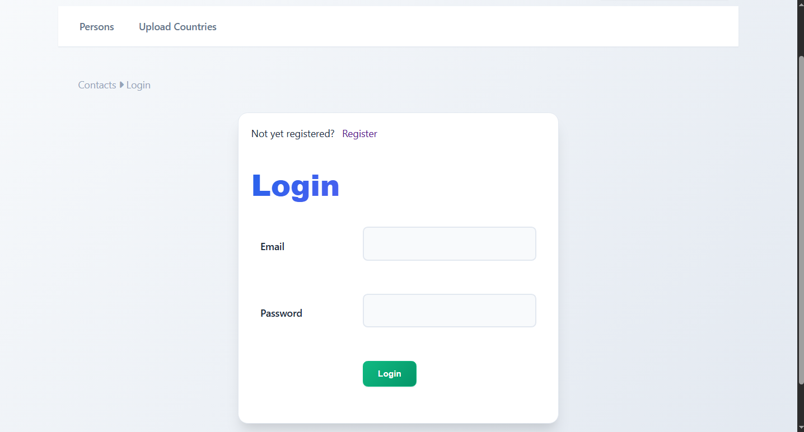
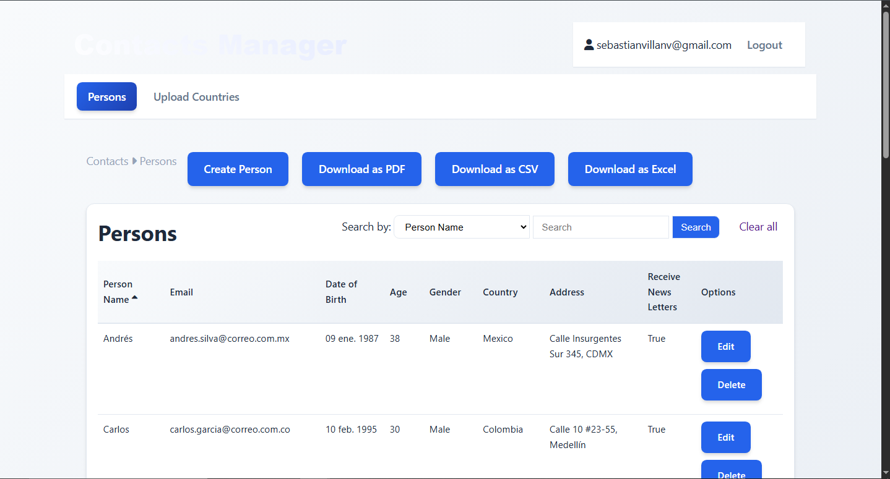
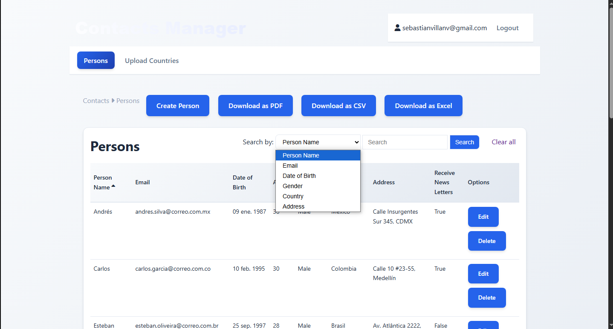
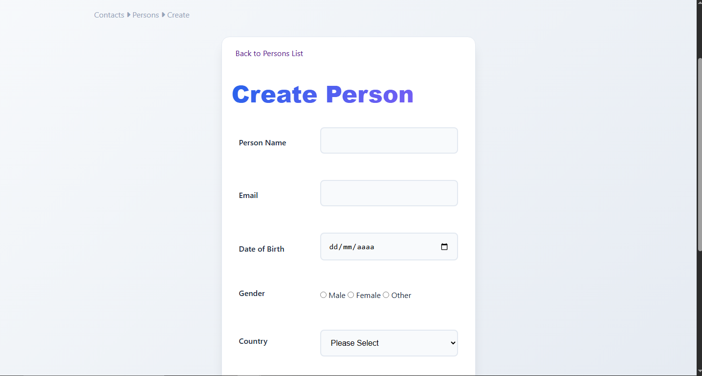
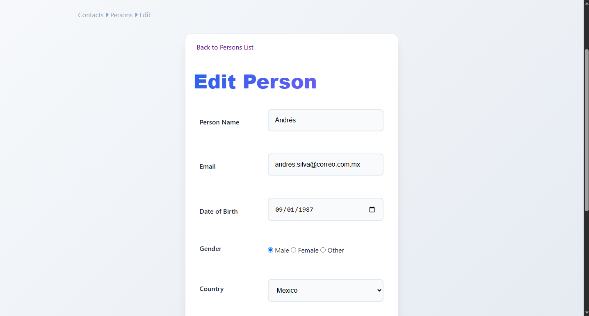
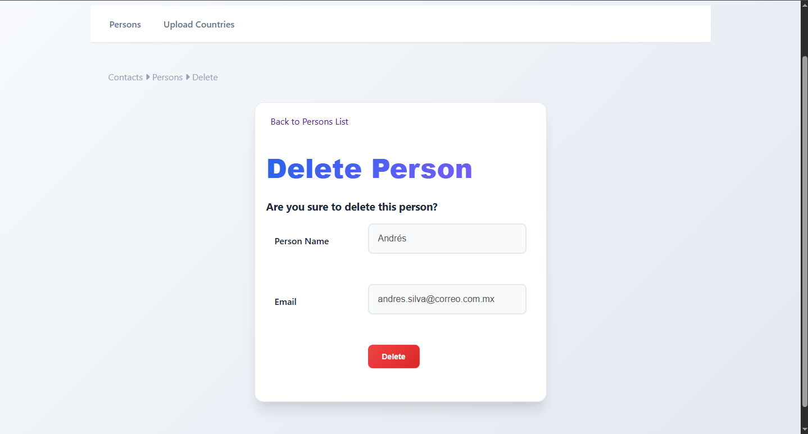
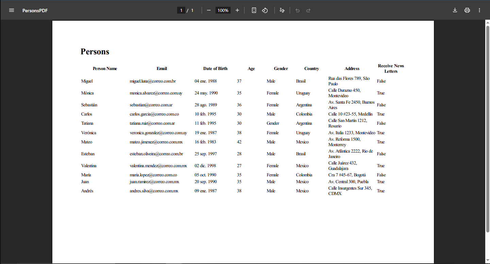

# 👥 ContactsManager (ASP.NET MVC)

Aplicación web desarrollada con **ASP.NET MVC** para gestionar contactos personales. Permite realizar operaciones CRUD, autenticación, validaciones, importación/exportación de datos y pruebas automatizadas.

---

## 🚀 Funcionalidades principales

- Registro, edición, eliminación y listado de contactos
- Autenticación y autorización con **ASP.NET Identity**
- Importación y exportación de contactos en **CSV, Excel y PDF**
- Validaciones del lado cliente y servidor
- Panel de administración y navegación amigable con **Bootstrap**
- Pruebas unitarias con **xUnit**

---

## 🧪 Capturas del proyecto

### 🔐 Login


### 🏠 Vista principal con listado de personas


### 📤 Filtro por múltiples criterios


### ➕ Crear persona


### ✏️ Editar persona


### ❌ Eliminar persona


### 📁 Importar países desde Excel


### 📄 Exportar a PDF


---

## 🧱 Tecnologías utilizadas

- **Backend:** ASP.NET MVC, C#, Entity Framework Core
- **Frontend:** Razor Pages, HTML, CSS, Bootstrap
- **Autenticación:** ASP.NET Identity
- **Base de datos:** SQL Server
- **Testing:** xUnit
- **Exportación de datos:** Excel, CSV, PDF

---

## 📁 Estructura del proyecto

- `ContactsManager.UI`: Proyecto principal MVC
- `ContactsManager.ControllerTests`: Proyecto de pruebas unitarias
- `Models`, `Controllers`, `Views`: Estructura tradicional MVC
- `wwwroot`: Archivos estáticos (CSS, JS, etc.)

---

## 🧪 Pruebas

Incluye pruebas unitarias para controladores mediante **xUnit**.  
Ubicación: `ContactsManager.ControllerTests/`

---

## 📦 Cómo ejecutar el proyecto

1. Clona el repositorio:
   ```bash
   git clone https://github.com/Seiked/ContactsManager.git
2. Abre la solución en Visual Studio

3. Configura la cadena de conexión en appsettings.json

4. Ejecuta las migraciones y lanza la aplicación

📌 Autor
Sebastián Villa Yepes
[LinkedIn](https://www.linkedin.com/in/seiked/) | [GitHub](https://github.com/Seiked)

